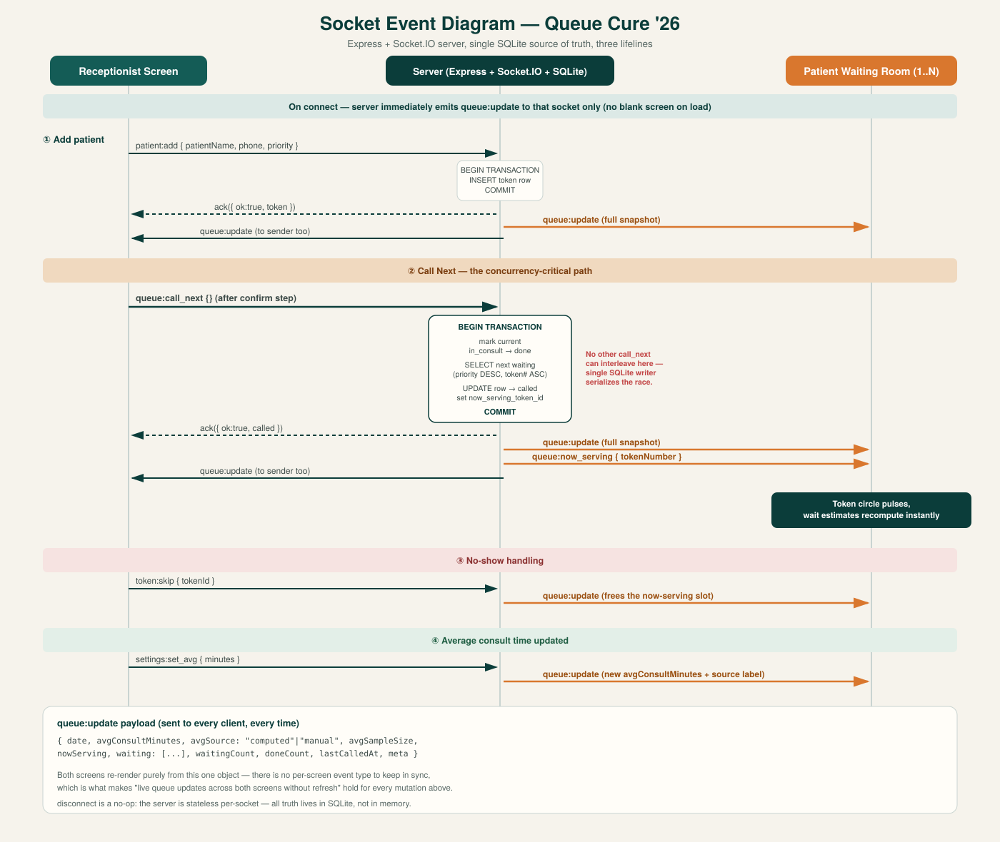

# Queue Cure '26 🩺

**A real-time clinic token queue — built for Queue Cure '26 (Wooble Hackathon).**

Replaces paper token slips and shouting with a live receptionist dashboard and a patient waiting-room display that update instantly, no refresh needed.

🔗 **Live demo:** [queue-cure-26-two.vercel.app](https://queue-cure-26-two.vercel.app)



---

## What it does

| Screen | What it's for |
|---|---|
| 🖥️ **Receptionist** (`/reception`) | Add patients, call the next token, mark no-shows, set/track average consult time. PIN-protected. |
| 📺 **Patient display** (`/waiting-room`) | Big "Now Calling" board with live wait estimates — built for a TV or tablet in the waiting room. |

Both screens share one Socket.IO connection — any action on the receptionist side reflects on every patient screen in real time.

## Stack

**Backend:** Node.js · Express · Socket.IO · SQLite
**Frontend:** React · Vite · react-router-dom

## Run it locally

```bash
# Backend
cd server
npm install
npm run dev      # http://localhost:4000

# Frontend (new terminal)
cd client
npm install
npm run dev       # http://localhost:5173
```

Open `/reception` (PIN: `1234`) and `/waiting-room` in two tabs to see live sync.

## Why wait time isn't hardcoded

Once 2+ consultations finish, the server averages the real duration of the last 10 completed consults and uses that for every wait estimate. Until then, it falls back to a manual average — clearly labeled `live data` vs `estimated` on screen.

## Docs

- 📊 [Socket event diagram](docs/socket-event-diagram.md)
- 🧠 [Thought process — concurrency & edge cases](docs/thought-process.md)

---

Built for **Queue Cure '26** on [Wooble](https://wooble.com).